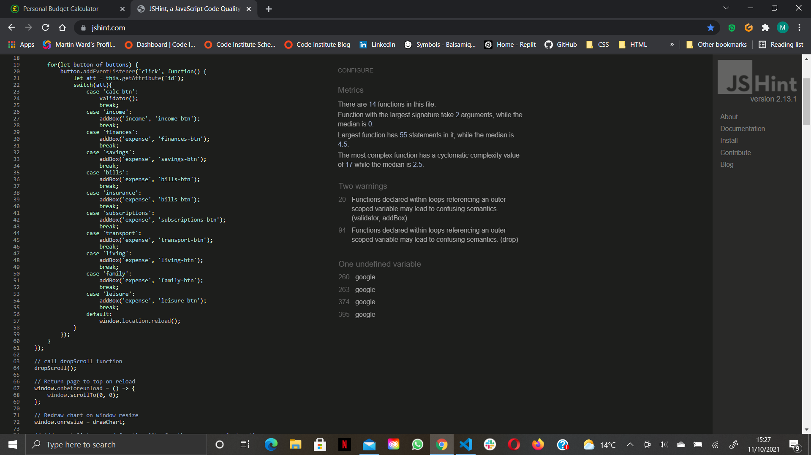

# Personal Budget Calculator

Personal Budget Calculator (or PBC) helps the user calculate their personal finances over the course of a month. The calculator will give the user a visual representation of their finances with balances and a chart to show how much of their income they are saving or where overspending occurs. The results will show a percentage of each outgoing element so they can identify where they can make further savings. The form can also be manipulated further to show the impact of these savings after a recalculation.

View live site here: https://mwarddev.github.io/personal-budget-calculator/

## Contents
* [Description](#personal-budget-calculator)
* [User Experience (UX)](#user-experience-ux)
    * [User Stories](#user-stories)
* [Design (UXD)](#design-uxd)
    * [Strategy](#strategy)
    * [Scope](#scope)
    * [Structure](#structure)
    * [Skeleton](#skeleton)
    * [Surface](#surface)
* [Features](#features)
    * [Existing Features](#existing-features)
    * [Future Features](#future-features)
* [Testing](#testing)
    * [Platforms](#platforms)
    * [Peer reviews](#peer-reviews)
    * [Validator Testing](#validator-testing)
* [Deployment](#deployment)
* [Credits](#credits)

## User Experience (UX)

### User Stories

#### External User Goals:
* The site users want a tool to easily calculate their monthly expenditure with results that make it easy to identify where savings can be made.

#### Site Owner Goals:
* The site owner’s goal is to provide the user with an easy-to-use tool to calculate their monthly expenditure.
* The site owner’s goal is to help the user to visualise where they can make savings by providing easy to read results and allowing them to adjust the form data to see where savings can be made.

## Design (UXD)

### Strategy
* Is the content culturally appropriate?
    * Yes. Content is supplied by the user and the results are a manipulation of the user’s data.
* Is the content relevant?
    * Yes. All content contains information about the subject matter.
* Can we track and catalogue the content in an intuitive way?
    * Yes. All content is stored as form data and is sectioned relative to the subject matter and to aid in the completion of the form.
* Is the technology appropriate?
    * Yes. Form data is the best way to collect user input. 
* Why are we so special? What sets us apart?
    * Every effort is being made to make the user’s experience as easy as possible.
* Tech considerations?
    * The site will be fully responsive and easily usable on all types of devices. The site will be created with HTML & CSS and controlled with JavaScript.
* Why would a user want this?
    * Users want this to aid in the calculation of their finances. This can be done in several ways by the user (writing info down and using a calculator or by creating a spreadsheet) but this site takes all the legwork out of it for them.

### Scope
* What does the user want to accomplish?
    * The user wants to work out their budget for the month.
* What does the user need to do in order to achieve their objective?
    * The user needs to input their data in an easy-to-use form and click the calculate button.
* What constraints does the site or app have to conform within?
    * Limited build time. No back end to store user data for a month-on-month review.
* What dynamic constraints do we have to meet?
    * Ensure calculations are correct and user input is correctly validated.

### Structure

The structure plane uses the information gathered in the strategy and scope planes to design a user-friendly layout for the site incorporating the wants and needs of the user.

* Heading (Personal Budget Planner)
* How to use (dropdown)
* Currency Selector (user input)

Income Section (user input)

 
* Wages (after tax)
* Pension
* Rent (collected from lodgers/tenants)
* Child Support Received
* Investments
* Benefits
* Add box (option to add more boxes, name them and remove them)

Finances/Debt (user input)

* Personal Loan
* Student Loan
* Credit Cards
* Store Cards
* Hire Purchase
* Catalogue
* Child Support
* Add box (option to add more boxes, name them and remove them)

Savings/Investments (user input)

* Savings Account Payments
* ISA Payments
* Child Savings/Trust Fund
* Investments
* Add box (option to add more boxes, name them and remove them)

Household Bills (user input)

 
* Mortgage/Rent
* Council Tax/Rates
* Gas
* Electricity
* Other Fule Costs (Oil, Coal, Wood)
* Water
* Add box (option to add more boxes, name them and remove them)

Insurance (user input)

 
* Home Insurance
* Contents Insurance
* Life Insurance
* Pet Insurance
* Home Appliance Insurance
* Boiler Cover Insurance
* High Value Items Insurance
* Vehicle Insurance
* Add box (option to add more boxes, name them and remove them)

Subscriptions/Direct Debits (user input)

 
* Internet
* Home Phone
* TV Subscriptions (Sky, Virgin Media, BT etc)
* Streaming Services (Netflix, Now TV, Prime Video etc)
* TV Licence
* Mobile Phone
* Gym Membership
* Website Subscriptions
* Book Club
* Add box (option to add more boxes, name them and remove them)

Transport (user input)

 
* Vehicle Tax
* MOT
* Servicing
* Fuel
* Public Transport
* Add box (option to add more boxes, name them and remove them)

Living Costs

 
* Groceries
* Clothing & Footwear
* Personal Health (medical care)
* Beauty & Grooming
* Repairs/Household Maintenance
* Cleaning Services
* Add box (option to add more boxes, name them and remove them)

Family (user input)

 
* Child Care
* Birthdays
* Christmas
* Vet Bills
* Pet Food
* Add box (option to add more boxes, name them and remove them)

Leisure (user input)

* Eating Out
* Days Out (include parking costs, admission, activity costs, food, and drink)
* Nights Out
* Household Drinking (alcohol)
* Takeaway Food
* Tobacco
* Add box (option to add more boxes, name them and remove them)

* Calculate Button/Re-calculate Button
    * Return Income
    * Return Expenditure Sum
    * Return Outcome Balance (savings = green/negative equity = red)
    * Display expenditure in a pie chart
    * Offer tips on where savings can be made (build time permitting)
* Reset Form Data Button
* Footer
    * Copyright Info
Once calculated, the user has the option to manipulate the form data and re-calculate to see where savings could be made.
Each user input box has the option to enter values per day, week, month, or year. The calculate function takes these into consideration and calculates what the value would be per month.

### Skeleton
The site will be designed to look similar on all devices and will be displayed on one page. A wireframe mock-up layout has been made using [Balsamiq](https://balsamiq.com).

View wireframes [here](assets/readme_images/pbc_wireframes.pdf)

### Surface
The final design plane looks at the aesthetic of the site. The goal is to create a visually appealing site whilst maitaining readability and accessability.

#### **Colour Palette**

I chose this simple palette from [coolors](https://coolors.co) to highlight positive and negative equity on the site.

#### **Typography**

All fonts have been imported from [Google Fonts](https://fonts.google.com/).

The Poppins font was chosen for headings for readability purposes and the Roboto font for all other text. This was also for readability and Roboto is a recommended pairing for the Poppins font.

#### **Iconography**

Favicon  created by myself as a .png file then coverted to an .ico file using [image.online-convert.com](https://image.online-convert.com/convert-to-ico).

## Features
### **Existing Features**
#### **How to use**

At the top of the screen there is a how to use drop down giving a short description of how the calculator works.
#### **Currency drop down**

The currency drop down allows the user to select one of 3 currencies. This places the selected currency symbol as a placeholder in each input box and prefixes the resulting totals.
#### **Period drop down**

The period drop down allows the user to select options of daily, weekly, monthly (default), and yearly for each number input box. This means, for instance, if the user is paid weekly, the weekly option can be selected for the wages row and when the form is calculated this value will be multiplied to a monthly value.
On calculating the form, all period selectors return to monthly to allow further calculations if the user wishes to amend form data after calculation.
#### **Add more boxes**

The Add more boxes button allows the user to add more data rows if needed. The boxes can also be named and removed with the Remove box button if not needed.
#### **Income only output**

If only income data is issued, the form will only output total income data at the bottom of the form and wil hide the chart section.
#### **Expenditure pie chart**

The pie chart is an api imported from Google charts. The chart is populated with user expenditure data and gives the user a visual representation of their monthly spend. Each section corresponds to the collapsable sections of the form. If the user feels they could adjust their spending for the month in order to save more, they can adjust data and recalculate to see the amended outcome.
#### **Form Validation**

On submitting the form data, all fields are checked through a validator function to check for minus values and values with more than 2 decimal places. The user then gets an alert and is asked to enter a valid value. The background of the field turns red until the value is changed and re-submitted.

#### **Collapsable sections**
Each section of the form is collapsable to keep the page tidy and not overwhelm the user with lots of form data all at once. Upon expanding the sections the form autoscrolls the section header to the top of the page to keep all form data in view.
Not all form data needs to be filled in for the form to be calculated. Any empty fields are calculated with zero value.

#### **Responsive**
The site is fully responsive down to 320px screen width using percentage measurements and media queries.

### **Future Features**
#### **Money saving tips**
User data could be used to evaluate if there are any areas in which they could save money and money saving tips could be displayed on calculation. For instance, if the user enters data in a personal loan field as well as credit cards, the output could display a tip for consolidating the debts into one affordable consolidation loan.
## Testing

### Platforms
* Desktop/Laptop with the following browsers:
    * Google Chrome - No issues, used to develop site.
    * Opera - One issue, remove box on wrong side of screen, used flex align-self to fix.
    * Microsoft Edge - no issues.
    * FireFox - No issues.
* iPad/iPhone - CSS issues with hidden details markers, fixed with -webkit-details-marker and display none.
* Android Phone - No issues.

### Peer Reviews
Code was deployed and links send to friends and family to review as well as posted in a Slack channel for fellow coders to review.
The following issues were raised:
* IOS CSS issues (covered above) - Fixed.
* Overlapping text on mobile phone - Fixed with a media query.
* Drawchart container warning in console on load - Caused by hidden div, moved div out of container, fixed.
* User able to input minus figures in input fields - Validator attributes added in HTML file, fixed.
* Upon suggestion from my mentor and family member large JS functions were split into smaller functions and called where needed - Fixed.

### Bugs & Fixes
| Bug | Fix |
| --- | --- |
| Entering a zero into an input field would raise a validator error. | Validate for >= 0. |
| Misaligned elements at top of page on smaller screens. | Add media query to align with other elements. |
| Added boxes not updating Google chart. | Add relevant class names to addBox function to be recognised by Google chart. |
| Transport section not updating Google chart. | Transport section missing from drawChart function, added transport section. |
| Google chart not rendering at the correct size when called on large screens but rendering full size when re-called or screen re-sized. | Issue is known to be caused when the chart div is hidden. To counter the issue the drawChart function is called twice when the "Calculate" button is clicked. |

#### Validator Testing
#### CSS
CSS code was run through the W3C CSS Jigsaw validator with no errors and 3 warnings. The first was for importing a google api for google fonts and the second and third were for the aforementioned webkits which are needed for my code to work on IOS.

#### HTML
HTML code was run through the W3C Markup validation service with no reported errors.

#### JavaScript
JavaScript code was run through the Jshint validator with 2 warnings for functions declared within loops (these were used to assign buttons and the auto scroll feature of the site) and one undefined variable (google). This was due to the gstatic api needing to be loaded from the head of the HTML file.

#### Lighthouse
Finally, a lighthouse report was run with 100% in all areas.

## Deployment

The site was deployed to Github pages using the following steps:
* In the Github repository, navigate to the settings tab.
* Scroll down and select Pages from the left side navigation menu to open Github pages.
* In the Source section, click on the dropdown menu and select the Master branch.
* Once the Master branch is selected the page will refresh to display a message stating "your site is published at https://mwarddev.github.io/personal-budget-calculator/
## Credits

* Stackoverflow.com was utilised on many occasions for syntax referencing and inspiration during the build of this site as was eloquentjavascript.net.
* Anthony Ugwu (my mentor) helped me out tremedously with debugging an issue with the period drop down menus.
* The scroll into view function was taken from the [developer.mozilla.org](https://developer.mozilla.org/en-US/docs/Web/API/Element/scrollIntoView) website.
* [Google charts](https://developers.google.com/chart/interactive/docs/quick_start) was used to build the pie chart in the results section.
* Friends and family for helping me test the site and offering suggestions on how to improve it.